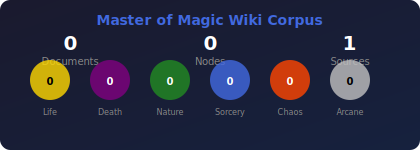

# Master of Magic Wiki Corpus



A knowledge corpus for the classic 4X fantasy game **Master of Magic** (1994), designed for AI agent RAG (Retrieval-Augmented Generation) queries.

## Features

- **Multi-Source Scraping**: Web pages, PDF documents, LBX game data files
- **REST API**: Full programmatic access to corpus data
- **MCP Server**: AI agent integration via Model Context Protocol
- **3D Graph Visualization**: Interactive node exploration with Three.js
- **Admin UI**: Source configuration and scrape management

## Quick Start

### Installation

```bash
# Clone the repository
git clone https://github.com/jbalcomb/simtexwiki.git
cd simtexwiki

# Install Python dependencies
pip install -r requirements.txt

# Install frontend dependencies (optional)
cd frontend && npm install && cd ..
```

### Configure Sources

```bash
# Add a web source
python -m mom_wiki.cli add-source "MoM Wiki" web "https://masterofmagic.fandom.com/wiki/Spells"

# Add a PDF manual
python -m mom_wiki.cli add-source "Game Manual" pdf "data/pdf/manual.pdf"

# Add LBX game data
python -m mom_wiki.cli add-source "Spell Data" lbx "data/lbx/SPELLDAT.LBX"
```

### Run Scrapers

```bash
# Scrape all sources
python -m mom_wiki.cli scrape

# Check status
python -m mom_wiki.cli status
```

### Start Services

```bash
# REST API (http://localhost:8000)
python -m mom_wiki.cli serve

# MCP Server (for Claude Desktop)
python -m mom_wiki.cli mcp-serve
```

## API Endpoints

| Endpoint | Method | Description |
|----------|--------|-------------|
| `/search?q=fireball` | GET | Full-text search |
| `/documents` | GET | List documents |
| `/documents/{id}` | GET | Get document details |
| `/nodes` | GET | List nodes |
| `/nodes/{id}` | GET | Get node details |
| `/nodes/{id}/related` | GET | Get related nodes |
| `/nodes/graph` | GET | Get graph data for visualization |
| `/sources` | GET/POST | Manage sources |
| `/sources/{id}/scrape` | POST | Trigger scrape |

## MCP Tools

For AI agents using Model Context Protocol:

- `search_corpus`: Full-text search
- `get_document`: Retrieve document content
- `get_related`: Find related nodes
- `list_spells`: List spells by realm/rarity
- `list_units`: List units by race
- `get_game_mechanic`: Look up game mechanics

## Project Structure

```
mom_wiki/
├── models/          # Pydantic data models
├── scrapers/        # Web, PDF, LBX scrapers
├── storage/         # File and Drive storage
├── search/          # Full-text indexing
├── api/             # FastAPI REST API
├── mcp_server/      # MCP server
└── cli.py           # Command-line interface

frontend/src/
├── index.html       # 3D graph explorer
├── admin.html       # Admin panel
├── graph.js         # Three.js visualization
└── api.js           # API client

corpus/              # Data storage (gitignored)
├── documents/       # Document metadata
├── content/         # Markdown content
├── nodes/           # Node data
└── jobs/            # Scrape job records
```

## Node Types

| Type | Description |
|------|-------------|
| `spell` | Magic spells (combat, summoning, enchantments) |
| `unit` | Military units and heroes |
| `item` | Magic items and artifacts |
| `wizard` | AI opponent wizards |
| `ability` | Unit abilities and traits |
| `realm` | Magic realms (Life, Death, Nature, Sorcery, Chaos, Arcane) |
| `concept` | Game mechanics and rules |
| `page` | General wiki pages |

## Magic Realms

| Realm | Color | Focus |
|-------|-------|-------|
| Life | Gold | Healing, protection, holy |
| Death | Purple | Undead, curses, draining |
| Nature | Green | Summoning, buffs, terrain |
| Sorcery | Blue | Illusions, control, flight |
| Chaos | Red | Fire, destruction, chaos creatures |
| Arcane | Silver | Utility spells, all wizards |

## Development

```bash
# Run with auto-reload
python -m mom_wiki.cli serve --reload

# Rebuild search index
python -m mom_wiki.cli rebuild-index

# Generate stats badge
python -m mom_wiki.cli generate-stats
```

## License

MIT

## Acknowledgments

- Master of Magic by SimTex/MicroProse (1994)
- Master of Magic Wiki community
- MCP (Model Context Protocol) by Anthropic
